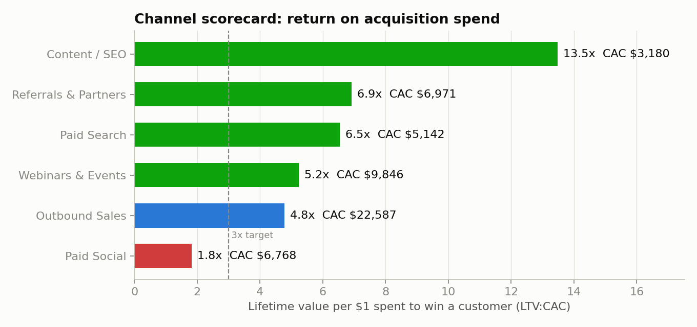
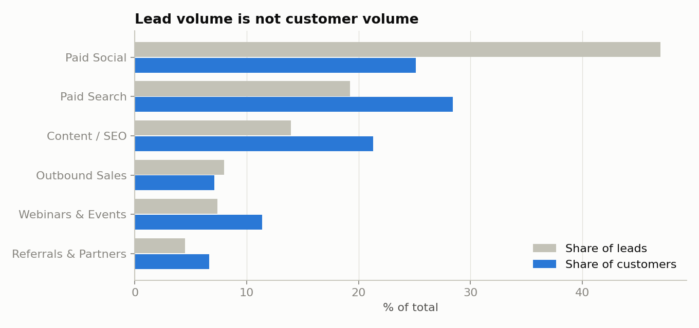

# GTM Compass: Channel Scorecard & Budget Scenario

Scores six go-to-market channels on what it costs to win a customer and what that customer is worth, then tests what happens if budget moves from the weakest channel to the strongest ones.

Built with Python (pandas, NumPy, matplotlib). No external data or API keys needed.

> **Data note:** the dataset is synthetic. `src/generate_data.py` simulates a year of spend and 12,782 leads for a made-up B2B software product with a fixed seed, so every number below is reproducible but is not from a real company.

## The question it answers

A go-to-market team with a fixed budget has to decide: *which channels deserve more money, and which deserve less?* Counting leads does not answer that, because a channel can bring many leads that never buy. This project follows each lead through to a paying customer and compares channels on four numbers:

| Metric | Plain meaning |
|---|---|
| Lead-to-customer % | Of every 100 leads, how many end up paying |
| CAC (customer acquisition cost) | Spend divided by customers won |
| Payback months | How long a customer's margin takes to repay their CAC |
| LTV:CAC | Lifetime value of a customer for each $1 spent to win them. 3x is the usual target |

## Results



| Channel | Spend | Leads | Customers | Lead-to-customer | CAC | Payback | LTV:CAC | Verdict |
|---|---|---|---|---|---|---|---|---|
| Content / SEO | $143,100 | 1,782 | 45 | 2.5% | $3,180 | 4.4 mo | 13.5x | Scale |
| Referrals & Partners | $97,600 | 575 | 14 | 2.4% | $6,971 | 8.5 mo | 6.9x | Scale |
| Paid Search | $308,500 | 2,459 | 60 | 2.4% | $5,142 | 8.7 mo | 6.5x | Scale |
| Webinars & Events | $236,300 | 942 | 24 | 2.5% | $9,846 | 11.6 mo | 5.2x | Scale |
| Outbound Sales | $338,800 | 1,019 | 15 | 1.5% | $22,587 | 14.8 mo | 4.8x | Keep |
| Paid Social | $358,700 | 6,005 | 53 | 0.9% | $6,768 | 21.2 mo | 1.8x | Fix or cut |

Total: $1.48M spend, 211 customers, blended CAC $7,028.

What the scorecard shows:

- **The channel with the most leads is the weakest.** Paid Social takes 24% of the budget and brings 47% of all leads, but only 25% of customers and 12% of new revenue. It is the only channel below the 3x target.
- **The highest CAC is not the worst channel.** Outbound Sales costs $22,587 per customer, three times the blended figure, yet returns 4.8x because half of its leads are Enterprise accounts with large contracts.
- **A few big accounts carry the revenue.** Enterprise is 9.5% of customers and 41% of new revenue. SMB is 55% of customers and 17% of revenue.



**Budget scenario.** Move half of the Paid Social budget ($179,350) into Content / SEO and Referrals & Partners, split evenly, with total spend unchanged:

| | Before | After | Change |
|---|---|---|---|
| Customers | 211 | 213 | +1.1% |
| New annual revenue | $2,100,900 | $2,300,309 | +9.5% |

Customer count barely moves, but revenue rises because the customers gained are larger accounts than the ones given up. The scenario assumes extra budget in a channel works 30% less well than its current budget, since the easiest customers in any channel are won first.

## How it works

**Data** (`data/`):

```
channel_spend.csv  month, channel, spend
leads.csv          lead_id, created_date, channel, segment, qualified, won, annual_contract_value
```

**Steps** (`src/scorecard.py`):

1. **Scorecard.** Group spend and leads by channel and compute the four metrics above. Lifetime value = annual contract value x gross margin / annual churn, so a customer in a segment that loses 25% of customers a year is expected to stay four years.
2. **Verdict.** Scale at 5x LTV:CAC or better, Keep from 3x to 5x, Fix or cut below 3x.
3. **Segment summary.** The same lead-to-customer view by SMB, Mid-market and Enterprise.
4. **Budget scenario.** Take a share of the weakest channel's spend, give it to the top two, and recompute customers and revenue.

**Assumptions**, all set at the top of `src/scorecard.py`:

| Assumption | Value |
|---|---|
| Gross margin | 80% |
| Annual churn | SMB 40%, Mid-market 25%, Enterprise 15% |
| Healthy LTV:CAC | 3x (Scale at 5x) |
| Budget moved in the scenario | 50% of the weakest channel |
| Efficiency loss on added budget | 30% |

## Run it

```bash
python -m venv .venv && source .venv/bin/activate
pip install -r requirements.txt
python src/generate_data.py   # writes data/
python src/scorecard.py       # writes outputs/
```

## Project layout

```
data/      channel_spend.csv, leads.csv (generated)
src/       generate_data.py, scorecard.py
outputs/   channel_scorecard.csv, segment_summary.csv, budget_scenario.csv, charts
```

## Limitations

- The data is simulated, with channel differences built in on purpose, so the findings show the method working rather than a real result.
- Each customer is credited to one channel. Real buyers often touch several before they sign.
- Referrals & Partners and Outbound Sales won 14 and 15 customers, so their figures would move a lot with a few more or fewer deals.
- Churn, margin and the 30% efficiency loss are assumptions. In practice they would come from finance and from testing a small budget shift first.
